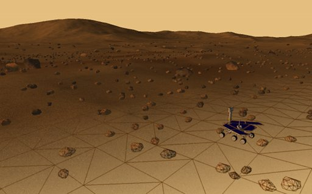
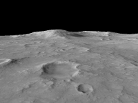
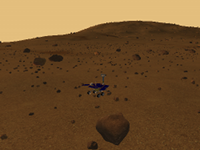
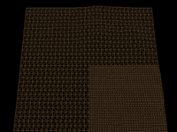
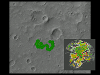
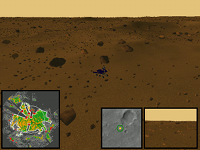
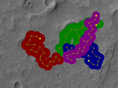
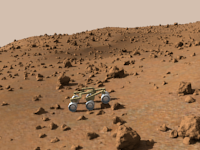
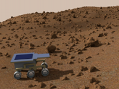

ExoPlanet Mission
=================

__ExoPlanet__ is an imaginary planetary exploration mission related to my final thesis _"Concept and Simulation for Autonomous Navigation of Planetary Rovers"_ [[DLR elib](http://elib.dlr.de/72296/)] for the space engineering programme of the Berlin [Institute of Technology](http://www.raumfahrttechnik.tu-berlin.de). Based on this mission (the name was selected referring to the planned ESA [ExoMars](http://www.esa.int/SPECIALS/ExoMars/index.html) mission), I present a base concept for the rover navigation. Therefore the The Sensor-based Random Tree (SRT) [Method](http://www.dis.uniroma1.it/~labrob/research/SRT.html) was adapted to work in 3D environments. As the practical part, the thesis consists of the development of an application for terrain rendering and visual sensor simulation. A generated planetary landscape was used for a basic proof of the navigation algorithms. The application is splitted into two sub projects:

__ExoSim__

The project about the 3D terrain modeling and visualization using the [OGRE](http://www.ogre3d.org) Library. ExoSim can be run as an interactive stand alone application or as a plug-in for the [Player](http://playerstage.sourceforge.net) robot server.

__ExoPath__

A client for the simulated sensor data to run navigation and path planning tasks. The GUI part is based on the Eclipse [RCP](http://wiki.eclipse.org/index.php/Rich_Client_Platform) Platform.

### See also

* [Video Gallery](#video-gallery) for examples and results
* [More Videos](#more-videos) of related experiments

### About

me: [stefan kral](&#109;ailt&#111;&#58;&#115;epp&#105;z&#64;&#103;mx&#46;de)

Video Gallery
-------------

The rendered MRO [terrain model](http://hirise.lpl.arizona.edu/dtm/dtm.php?ID=PSP_001513_1655) together with the related ortho image as texture. The selected Mars region is around Husband Hill (the landing site of the Mars Exploration Rover Spirit

The modeled planetary landscape. Different terrain parameters like obstacles (big stones), hazard (small stones), ground condition (dark areas) and the slope values are used to proof a navigation concept.

A demonstration of the geometrical mipmap technique provided by OGRE. The model resolution depends on the height value variation and the distance of the point of view.

The exploration process for a single rover. The overlay illustrates the navigation map for the current local region.

The rover's movement during autonomous exploration. On the left site the navigation map. On the right, the local areas on a global map and the rover camera view.

The exploration process for a distributed system of four rovers.

### Credits

_Digital terrain models of Mars are created from HiRISE stereo pairs_
NASA/JPL/University of Arizona/USGS
http://hirise.lpl.arizona.edu/dtm/dtm.php?ID=PSP_001513_1655

_Mars Exploration Rover Spirit and Opportunity_
Google 3D warehouse model by Alvaro
https://3dwarehouse.sketchup.com/model/9f1021ec701fd96dc82b8fee1057b30/Mars-Exploration-Rover-Spirit-and-opportunity

More Videos
-----------

The rover kinematics animated and rendered in Blender by making use of the Bullet physics engine.

A driving rover model, made with Blender.

